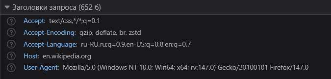
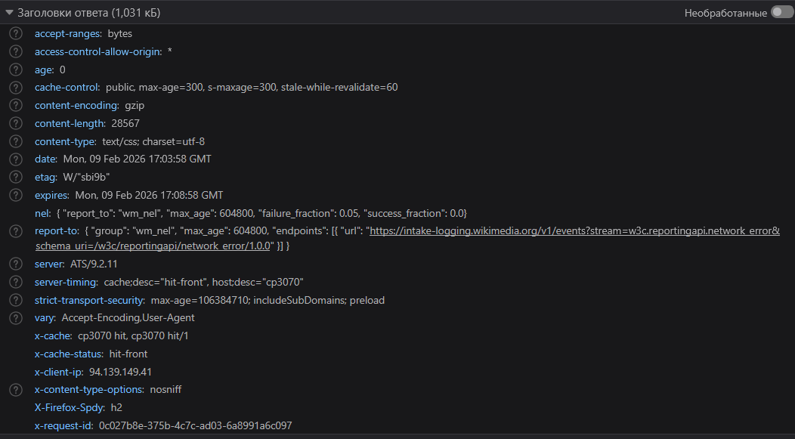
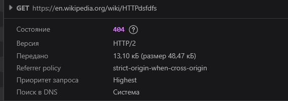
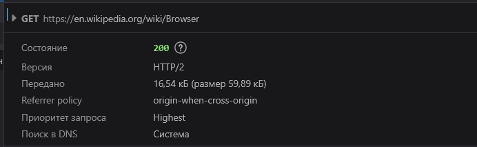
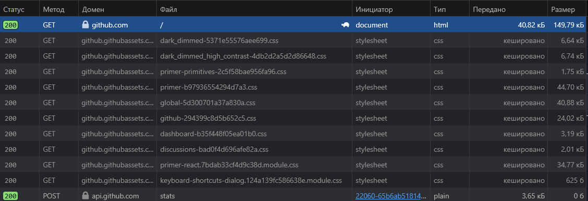

## Лабораторная работа №1

### Цель работы 
- Понять, что происходит, когда пользователь открывает сайт. 
- Научиться находить и анализировать HTTP-запросы в браузере. 
- Разобраться в назначении методов GET, POST, PUT, DELETE.

### Задание 1. Анализ HTTP-запросов. Часть 1

1. Переходим на сайт Wikipedia, переходим на вкладку Сеть и видим первый запрос: 

GET https://en.wikipedia.org/wiki/HTTP


**Почему именно данный метод используется для загрузки страницы?**

Для загрузки страницы используется GET-запрос, поскольку мы хотим получить данные, в данном случае веб-страницу

**Что означает статус ответа?**

Мы получили статус ответа **200OK**. Он означает что запрос выполнен успешно и страница, на которую мы перешли найдена и отображена.

**Какие заголовки запроса и ответа присутствуют и какую информацию они содержат?**

В запросе присутствуют следующие заголовки запроса: 



- **Accept** - говорит серверу форматы данных, которые клиент готов принять 
- **Accept-Encoding** - способы сжатия ответа, которые клиент умеет понимать 
- **Accept-Language** - предпочитаемый язык получения данных 
- **Host** - сервер понимает, к какому сайту обращается клиент 
- **User-Agent** - указывает серверу информацию об устройстве, браузере и клиенте 

И следующие группы заголовков ответа: 



- **Заголовки для управления кэшем и содержимым:** Accept-Ranges, Cache-Control, Content-Encoding, Content-Length, Content-Type, Expires, ETag. 
Эти заголовки говорят как хранить данные, сжимать их и узнать изменился ли ресурс.
- **Заголовки для контроля доступа и безопасности:** Access-Control-Allow-Origin, Strict-Transport-Security (HSTS), X-Content-Type-Options. Эти заголовки защищают сайт, указывают, кто может получать данные и как безопасно их обрабатывать.
- **Заголовки о сервере и сети:** Server, Server-Timing, Date, Age, Vary. Эти заголовки рассказывают, какой сервер отвечает, когда был сформирован ответ и сколько ресурсов можно использовать из кэша.
- **Заголовки для диагностики и аналитики:** X-Cache / X-Cache-Status, X-Client-IP, X-Firefox-SPDY, X-Request-ID, NEL / Report-To. Эти заголовки помогают, браузерам и прокси отслеживать запросы, кэширование и сетевые ошибки.

**Есть ли тело запроса или ответа? Если да, то что в нем содержится?**

В данном GET-запросе сервер возвращает ответ с телом в формате HTML, содержащим запрошенную веб-страницу. Тело запроса отсутствует, так как метод GET предназначен для получения ресурса и не использует тело запроса для передачи данных, вся информация передаётся через URL.

**Какие еще запросы были отправлены при загрузке страницы и почему?**

При загрузке страницы были отправлены еще несколько GET-запросов, которые возвращали данные разных форматов: CSS, JavaScript, SVG, PNG. Эти запросы позволили стилизовать веб-страницу, подгрузить необходимые изображения и обеспечить интерактивное взаимодействие со страницей.

2. Переходим по адресу https://en.wikipedia.org/wiki/HTTPdsfdfs

Первый GET-запрос на получение веб-страницы возвращает статус **404 NotFound**, который означает что сервер не может найти запрошенный ресурс, в данном случае ввиду того, что такой страницы в википедии нет. 



Аналогично предыдущему запросу, при загрузке страницы, были отправлены еще несколько GET-запросов, для стилизации страницы, загрузке изображений и обеспечения взаимодействия. Каждый запрос содержит заголовки ответа и запроса, которые содержит метаданные, описывают контент, параметры запроса, настройки кэширования и идентификации, позволяя таким образом сторонам понимать, как правильно обрабатывать получить данные 

### Задание 2. Анализ HTTP-запросов. Часть 2

Переходим по ссылке и выполняем поиск по слову browser. 

**Какой URL используется для выполнения поиска?**

Для поиска используется следующий URL https://en.wikipedia.org/wiki/Browser с методом запроса GET, поскольку мы хотим получить данные от сервера. 



Этот запрос не имеет параметров, вся необходимая информация передана в пути, в данном случае в пути определяется идентификатор статьи, которая была запрошена.

### Задание 3. Анализ HTTP-запросов. Часть 3

Переходим по ссылке https://www.github.com/ 

Как и в предыдущих примерах, мы отправляем GET-запрос, поскольку хотим получить веб-страницу гитхаба.



Вместе с основным запросом, выполняется ряд других, для стилизации и взаимодействий. Каждый запрос отправляется с метаданными с различными заголовками, которые обеспечивают взаимодействие браузера с сервером. 

### Задание 4. Составление HTTP-запросов

1. Составим GET-запроc на адрес с заголовком User-Agent:

```
GET http://sandbox.usm.com
User-Agent: Nadejda Statova 
```

**Что такое User-Agent и для чего он используется?**

User Agent (UA) - это строка, которую клиентское приложение передаёт серверу при выполнении HTTP-запроса. Она содержит информацию о браузере, его версии, операционной системе и характеристиках устройства. Сервер анализирует User Agent, чтобы определить тип клиента и предоставить наиболее подходящий контент.
User Agent применяется для: 

- **адаптации контента** - позволяет серверу определить тип устройства пользователя и отобразить соответствующую версию сайта, например мобильную или десктопную;
- **оптимизации ресурсов** - используется для выбора наиболее подходящих файлов и форматов, что снижает нагрузку и ускоряет загрузку страницы;
- **сбора статистики** - помогает анализировать, какими браузерами и устройствами пользуются посетители сайта;
- **фильтрации ботов** - применяется для распознавания автоматических запросов и ограничения доступа для нежелательных программ.

2. Составим следующий PUT-запрос с полями make, model, year в теле запроса

```
POST http://sandbox.usm.com/cars
Content-Type: application/json

make: Toyota
model: Corolla
year: 2020
```
**Какие еще методы HTTP-запросов существуют и для чего они используются?**

| Метод   | Назначение |
|--------|------------|
| GET    | Запрашивает представление ресурса. Используется только для получения данных без изменения состояния на сервере. |
| HEAD   | Аналогичен GET, но сервер возвращает только заголовки без тела ответа. |
| POST   | Используется для отправки данных на сервер и создания или изменения ресурса. Часто вызывает побочные эффекты. |
| PUT    | Полностью заменяет текущее представление ресурса данными из запроса. |
| DELETE | Удаляет указанный ресурс на сервере. |
| CONNECT| Устанавливает сетевой туннель к серверу (например, для HTTPS через прокси). |
| OPTIONS| Возвращает информацию о доступных методах и параметрах взаимодействия с ресурсом. |
| TRACE  | Выполняет диагностический запрос и возвращает полученный запрос обратно. |
| PATCH  | Используется для частичного изменения существующего ресурса. |

3. Составим PUT-запрос к серверу по адресу http://sandbox.usm.com/cars/1, указав в заголовке User-Agent имя и фамилию, в заголовке Content-Type значение application/json и в теле запроса параметры model, year, make:
```
PUT http://sandbox.usm.com/cars/1
User-Agent: Nadejda Statova
Content-Type: application/json

make: Toyota
model: Corolla
year: 2021
```
**В чем разница между PATCH и PUT запросами?**


**PUT** используется для полной замены ресурса, при этом необходимо отправить полный обновлённый объект, даже если изменилось только одно поле. Всё, что не указано в запросе, исчезает.

Например, если нужно обновить профиль пользователя и указать только поле name, но не email или номер телефона, то сервер может удалить недостающие поля. 

**PATCH** применяется для частичного обновления ресурса, при этом можно изменить только определённые поля, не затрагивая остальные. Это делает PATCH более эффективным для небольших обновлений. 

Например, если нужно обновить только имя пользователя, то в запросе PATCH нужно указать только поле name, а сервер применит это изменение без модификации других полей. 

4. Дан следующий запрос: 

```
POST /cars HTTP/1.1
Host: sandbox.com
Content-Type: application/json
User-Agent: John Doe
model=Corolla&make=Toyota&year=2020
```

Данный POST-запрос может вернуть JSON-данные с информацией о созданном объекте, например идентификатор автомобиля и переданные параметры.

Например: 
```
{
  "id": 1,
  "model": "Corolla",
  "make": "Toyota",
  "year": 2020
}
```
Сервер может вернуть разные коды в зависимости от ситуации 

| **Код состояния**         | **Ситуация**                                                                                                                                                                     |
|---------------------------|----------------------------------------------------------------------------------------------------------------------------------------------------------------------------------|
| 200 OK                    | Запрос успешно выполнен, сервер вернул данные (например, обновлённый или подтверждённый объект). Используется, если объект уже существовал или операция не создала новый ресурс. |
| 201 Created               | Новый объект успешно создан на сервере. Чаще всего используется для POST-запросов при добавлении новой записи.                                                                   |
| 400 Bad Request           | Запрос содержит ошибку: некорректные параметры, неверный формат данных или отсутствие обязательных полей.                                                                        |
| 401 Unauthorized          | Попытка выполнить запрос без авторизации, если доступ к созданию ресурсов требует аутентификации.                                                                                |
| 403 Forbidden             | Клиент авторизован, но не имеет прав доступа для выполнения операции (например, роль guest вместо user или admin).                                                               |
| 404 Not Found             | Указанный эндпоинт `/cars` не существует на сервере.                                                                                                                             |
| 500 Internal Server Error | Ошибка на стороне сервера, например сбой базы данных или необработанное исключение.                                                                                              |
