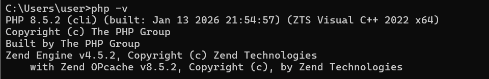
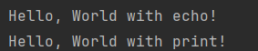

## Лабораторная работа №2. Установка и первая программа на PHP

### Цель работы: 
Целью данной лабораторной работы является установка и настройка среды разработки для работы с языком программирования PHP, а также создание первой программы на PHP.

#### Шаг 1. Установка PHP

Загружаем актуальную версию PHP c официального сайта https://www.php.net/downloads.

Распаковываем архив, добавляем путь в переменные среды 

Проверяем установку, выполнив в командной строке: **php -v**



#### Шаг 3. Написание первой PHP-программы

Создаем директорию проекта и файл **index.php**, вставляем код в текстовый редактор: 

```php
<?php

echo "Привет, мир!";
```

Запускаем программу и видим в терминале написанный нами текст
#### Шаг 4. Вывод данных в PHP

Выводим строки, используя функции **echo**, **print**

```php
echo "Hello, World with echo!";
print "Hello, World with print!";
```

Выводится следующий текст в терминале:



#### Шаг 5. Работа с переменными и выводом

Объявляем 2 переменные и присваиваем значения:
```php
$days = 288;
$message = " Все возвращаются на работу! ";
```

Выводим значения на экран с использованием конкатенации:
```php
echo $message . " в течении " . $days . " дней!<br> ";
```

И с использованием двойных кавычек
```php
echo "{$message} в течении {$days} дней\n";
```
Получаем следующий вывод: 


#### Контрольные вопросы 

1. **Какие способы установки PHP существуют?**

Существует два основных способа установки PHP, каждый из которых подходит под определенные сценарии 

- **Отдельная установка PHP**. При таком методе скачивается только PHP, настраиваются переменные среды, и используется встроенный веб-сервер PHP. Подходит для простого и минималистичного обучения. 
- **Установка готового пакета (XAMPP, OpenServer)**. При этом методе устанавливается готовый комплект инструментов в виде одной программы. Мы получаем локальный сервер, который ведет себя аналогично реальному серверу в интернете. Подходит для учебного процесса: минимум ручных настроек и быстрый старт.

2. **Как проверить, что PHP установлен и работает?**

В зависимости от способа установки, корректную работу можно проверить следующими способами: 

- Если PHP установлен отдельно, то правильную остановку необходимо проверить через команду в терминале **php -v**. Если мы видим информацию про версию PHP, значит все установлено верно, в противном случае, в каком-то из шагов была допущена ошибка 
- Если PHP был установлен в составе готовой сборки, необходимо проверить через браузер. Необходимо запустить наш веь-сервер и открыть в браузере **http://localhost**. Если открывается стартовая страница, значит все работает корректно. 

**3. Чем отличается оператор echo от print?**

echo и print - это операторы в PHP, которые используются для вывода данных на экран. 

Отличие заключается в том, что echo может выводить сразу несколько значений и ничего не возвращает. Он работает немного быстрее и поэтому используется чаще всего в обычных программах.

print же выводит только одно значение, но при этом возвращает число 1, из-за чего его можно использовать внутри выражений и присваиваний.

На практике почти всегда используется echo, print в случаях, когда важно, чтобы оператор возвращал значение.