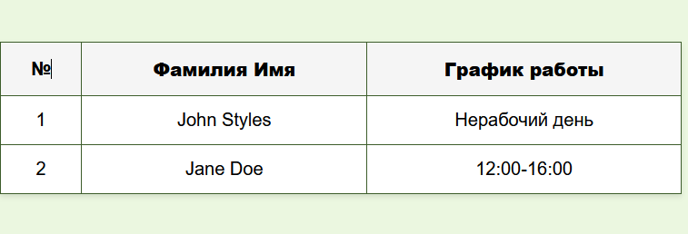
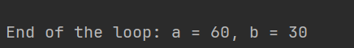

## Отчет по лабораторной работе № 3: Управляющие конструкции

### Задание 1: Используя функцию date(), создать таблицу с расписанием, формируемым на основе текущего дня недели.

- Для John Styles (xx - xx): Если текущий день недели — понедельник, среда или пятница, выведите график работы 8:00-12:00. В остальные дни недели выведите текст: Нерабочий день. 
- Для Jane Doe (yy - yy): Если текущий день недели — вторник, четверг или суббота, выведите график работы 12:00-16:00. В остальные дни недели выведите текст: Нерабочий день.

В начале выполнения задания, создаем 2 ассоциативных массива. Первый массив `$shifts` содержит возможные графики работы: 
```php
$shifts = [
    "morningShift" => "8:00-12:00",
    "dayShift" => "12:00-16:00",
    "dayOff" => "Нерабочий день"
];
```
Второй двумерный массив содержит информацию о сотрудниках: их имена, рабочие дни и график работы.

Далее, выделяем функцию `getCurrentShift`, которая принимает как параметр имя сотрудника и в зависимости от дня недели, выводит его график работы.

```php
...
$currentWeekDay = date('l');

    foreach ($shiftsSchedule as $employee) {
        if ($employee["name"] == $employeeName) {
            return in_array($currentWeekDay, $employee["workDays"])
                    ? $employee["shift"]
                    : $shifts["dayOff"];
```
Текущий день недели определяется с помощью функции `date('l')`, которая возвращает полное название дня недели на английском языке.

Далее создаем HTML-таблицу, которая отображает информацию для каждого сотрудника. В цикле `foreach` вызываем функцию `getCurrentShift` для каждого сотрудника, которая вычисляла его график.
```php
<?php
    foreach ($shiftsSchedule as $index => $employee) {
        echo "<tr>
                <td>" . $index+1 . "</td>
                <td>" . $employee["name"] . "</td>
                <td>" . getCurrentShift($employee["name"]) . "</td>
              </tr>";
    }
    ?>
```

Итоговая таблица выглядит следующим образом (день недели на момент выполнения работы - `Thursday`)



### Задание 2: Работа с циклами. 

Создаем файл со следующим кодом: 

```php
<?php

$a = 0;
$b = 0;

for ($i = 0; $i <= 5; $i++) {
   $a += 10;
   $b += 5;
}

echo "End of the loop: a = $a, b = $b";
```

Добавляем вывод промежуточных значений переменных `$a` и `$b` используя оператор `echo`

```php
echo "Iteration № $i: \n";
echo "A is equal to $a \n";
echo "B is equal to $b \n \n";
```

Итоговый вывод: 



Перепишем этот же код, используя цикл `while`:

```php
function whileLoopTest(): void
{
    global $a, $b;
    $i = 0;

    echo "\n --------Testing WHILE loop-------- \n";

    while($i <= 5){
        $a += 10;
        $b += 5;
        $i++;

        echo "Iteration № $i: \n";
        echo "A is equal to $a \n";
        echo "B is equal to $b \n \n";


    }
    echo "End of the loop: a = $a, b = $b";
}
```

Вывод будет такой же, как в первом варианте.

Переписываем код, используя цикл `do-while`:

```php
function doWhileLoopTest(): void
{
    global $a, $b;
    $i = 0;

    echo "\n --------Testing DO_WHILE loop-------- \n";

    do {
        $a += 10;
        $b += 5;
        $i++;

        echo "Iteration № $i: \n";
        echo "A is equal to $a \n";
        echo "B is equal to $b \n";
    } while ($i <= 5);

    echo "End of the loop: a = $a, b = $b";
}
```
При вызове этого метода, вывод будем таким же, как и в предыдущих вариантах.

### Контрольные вопросы

1. **В чем разница между циклами for, while и do-while? В каких случаях лучше использовать каждый из них?**

- Цикл `for` используется, когда известно количество итераций заранее. Он состоит из трех частей: инициализации, условия и инкремента. Этот цикл удобен для перебора массивов или выполнения определенного количества повторений.
- Цикл `while` используется, когда количество итераций неизвестно и зависит от определенного условия. Он выполняется, пока условие истинно. Этот цикл подходит для ситуаций, когда нужно продолжать выполнение до тех пор, пока не будет достигнуто определенное состояние.
- Цикл `do-while` гарантирует, что тело цикла будет выполнено хотя бы один раз, так как условие проверяется после выполнения тела. Этот цикл полезен, когда нужно выполнить действие хотя бы один раз, а затем продолжать выполнение, пока условие истинно.

2. **Как работает тернарный оператор ? : в PHP?**

Тернарный оператор `? :` в PHP является сокращенной формой условного оператора `if-else`. Он позволяет выполнить условное выражение и вернуть одно из двух значений в зависимости от результата этого выражения. Если условие истинно, возвращается первое значение, если ложно - второе. 

К примеру, в ходе выполнения первого задания был использован тернарный оператор для вычисления графика работы сотрудника. Если текущий день недели находился в списке рабочих дней, выводился соответствующий график работы, если нет - выводилась надпись о нерабочем дне.

```php
return in_array($currentWeekDay, $employee["workDays"])
    ? $employee["shift"]
    : $shifts["dayOff"];
```

3. **Что произойдет, если в do-while поставить условие, которое изначально ложно?**

В этом случае, тело цикла будет выполнено хотя бы один раз, несмотря на то, что условие не будет выполнено. Это происходит потому, что в цикле `do-while` проверка условия происходит после выполнения тела цикла.